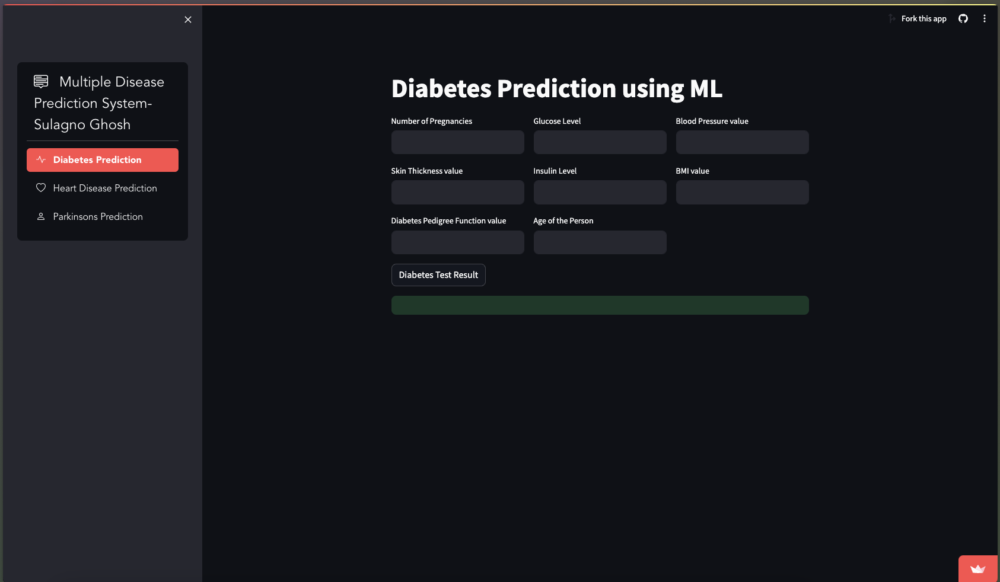

# HealthGuard: Machine Learning for Heart Disease and Diabetes Detection


## Introduction

Welcome to HealthGuard, a state-of-the-art machine learning application focused on detecting heart diseases and diabetes. Developed in Python and powered by Streamlit, this project leverages advanced data science tools like NumPy, Pandas, Scikit-learn, and Matplotlib to analyze and predict health risks. HealthGuard is not just a technical showcase but a step towards impactful healthcare analytics.

## Features

- **Advanced ML Algorithms**: Implements Support Vector Machines and Logistic Regression to predict heart diseases and diabetes.
- **Data-Driven Insights**: Analyzes over 700 data points to ensure comprehensive and reliable predictions.
- **High Accuracy**: Achieved an overall accuracy of 84% through meticulous testing and optimization of model parameters.
- **Interactive Web Application**: Utilizes Streamlit for an interactive, user-friendly web interface.
- **Data Visualization**: Incorporates Matplotlib for intuitive and insightful data visualizations.
- **Google Colab Integration**: Leverages Google Colab for efficient, cloud-based data processing and model training.

## Getting Started

### Prerequisites

- Python 3.x
- Streamlit
- NumPy
- Pandas
- Scikit-learn
- Matplotlib

### Installation

1. **Clone the Repository**
   ```bash
   git clone https://github.com/your-username/healthguard.git
   cd healthguard
2. **Install Dependencies**
   ```bash
   pip install -r requirements.txt

3. **Run the streamlit app**
   ```bash
   streamlit run app.py


### Usage

Data Input: Input patient data to analyze risk for heart disease and diabetes.
Model Selection: Choose between SVM or Logistic Regression for prediction.
Visualization: View graphical representations of the data and predictions for better understanding.
Contributing

We welcome contributions to improve HealthGuard. If you have suggestions or improvements, please fork the repository and submit a pull request.

### License

HealthGuard is released under the MIT License. Feel free to use it for personal and commercial purposes.


### Motive
HealthGuard combines machine learning and data analytics to make a difference in the healthcare sector. Your participation and feedback can help us make strides in predictive health analytics. Let's make healthcare smarter with HealthGuard!
